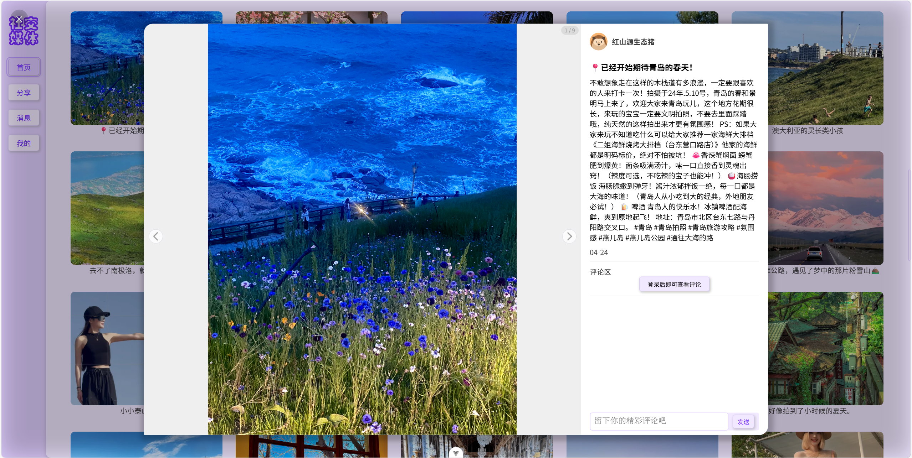
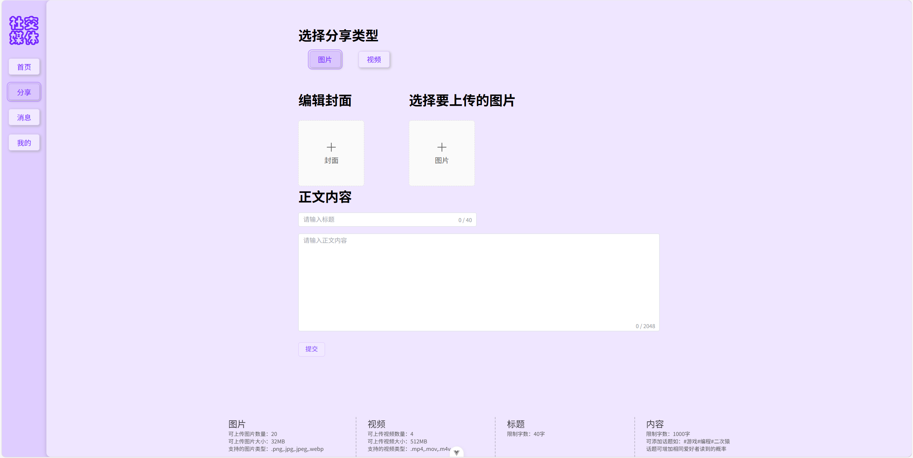
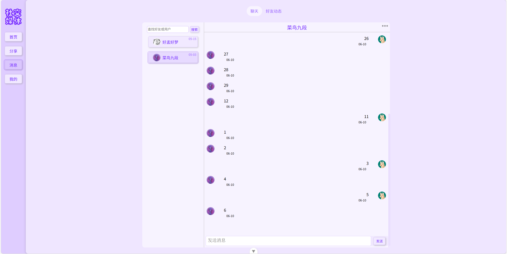
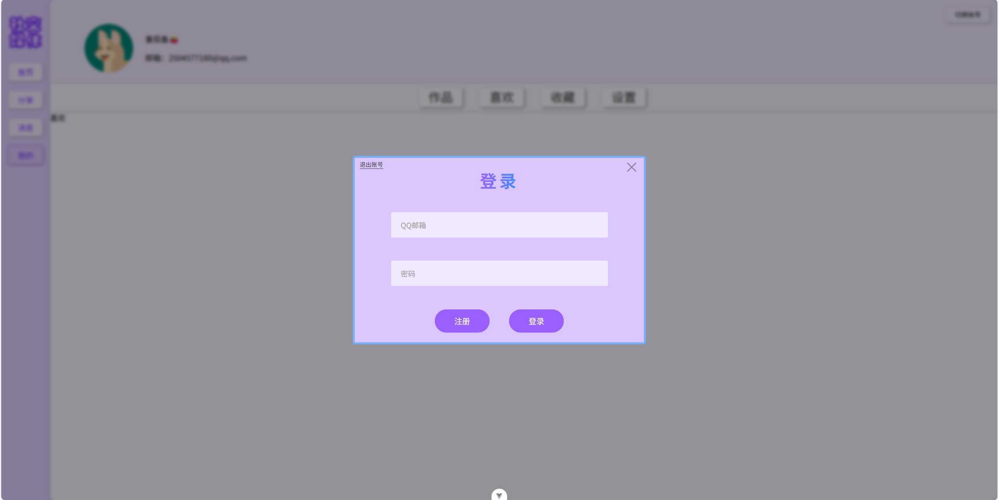

<div align="center">

# 社交媒体系统

基于 Vue 3 + Spring Boot + MyBatis + MySQL 的社交媒体平台

</div>

<p align="center">
  
</p>

## 概述

一套前后端分离的社交媒体平台，采用模块化架构，提供完整的用户、内容、社交与即时消息能力。前端基于 Vue 3 构建 SPA，后端基于 Spring Boot 提供 RESTful API 并通过 WebSocket 实现实时通信。

> 本仓库仅包含系统源码、原型设计及数据库示例数据，图片、视频等媒体资源不在仓库范围内。

## 功能特性

| 模块 | 能力 |
| --- | --- |
| 用户管理 | 注册 / 登录（邮箱验证码）、资料维护 |
| 内容管理 | 动态发布、热门推荐、动态详情 |
| 社交互动 | 点赞、收藏、关注、评论 |
| 消息系统 | 基于 WebSocket 的实时聊天、好友在线状态 |

## 技术栈

**前端**

- Vue 3 + TypeScript
- Vue Router、Pinia（路由与状态管理）
- Element Plus（UI 组件库）
- Axios（HTTP 客户端）、WebSocket（实时通信）
- Sass、Vite

**后端**

- Spring Boot 3.4.4（JDK 21）
- MyBatis（ORM）
- Spring WebSocket（长连接）
- Spring Mail（QQ 邮箱验证码）
- Lombok、Jackson

**存储**

- MySQL 9.2

## 项目结构

```
.
├── social_media_vue/              # 前端（Vue 3 + Vite）
│   └── src/
│       ├── views/                 # 页面：Home / Hot / Issue / Message / Me
│       ├── components/            # 通用组件
│       ├── router/                # 路由配置
│       ├── store/                 # Pinia 状态
│       ├── utils/                 # 工具（含 request.ts 封装 Axios）
│       └── types/
├── social_media_springboot/       # 后端（Spring Boot + MyBatis）
│   └── sm_springboot/             # Maven 项目根
│       └── src/main/
│           ├── java/.../          # controller / service / mapper / pojo
│           └── resources/         # application.yml
├── 数据库表格数据/                 # 各表示例数据（.xlsx）
├── screenshots/                   # 系统成品截图
├── 社交媒体系统原型.rp            # Axure 原型文件
└── README.md
```

## 快速开始

### 环境要求

| 依赖 | 版本 |
| --- | --- |
| Node.js | 18+（推荐 LTS） |
| JDK | 21 |
| Maven | 3.6+ |
| MySQL | 9.2 |

### 1. 准备数据库

1. 在 MySQL 中创建数据库 `social_media_java`（建议字符集 `utf8mb4`）
2. 参照 `数据库表格数据/` 下各 `.xlsx` 建立对应表结构并导入数据

### 2. 启动后端

1. 使用 IDEA 打开 `social_media_springboot/sm_springboot`
2. 编辑 `src/main/resources/application.yml`：
   - 数据库地址、用户名、密码
   - 邮箱账号与授权码（用于发送验证码）
   - `spring.web.resources.static-locations` 指向的媒体资源目录
3. 使用 Maven 加载项目依赖
4. 运行主类 `SmSpringbootApplication.java`，后端监听 `8080` 端口

### 3. 启动前端

```bash
cd social_media_vue
npm install
npm run dev
```

启动前，将 `social_media_vue/src/utils/request.ts` 中的 `baseUrl` 修改为后端地址，例如 `http://localhost:8080`。

## 系统截图

<p align="center"><b>首页</b></p>
<p align="center"></p>

<p align="center"><b>动态详情</b></p>
<p align="center"></p>

<p align="center"><b>分享</b></p>
<p align="center"></p>

<p align="center"><b>消息</b></p>
<p align="center"></p>

<p align="center"><b>登录</b></p>
<p align="center"></p>

## 其他说明

- `社交媒体系统原型.rp` 需使用 [Axure](https://www.axure.com/) 打开查看
- `数据库表格数据/` 为示例数据，需手动建表导入

## License

本项目仅用于学习交流。
